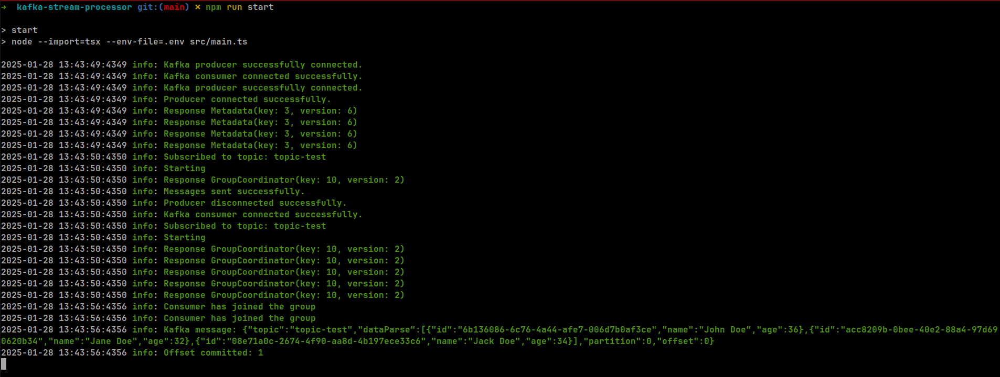

[](https://github.com/williamkoller/kafka-stream-processor/actions/workflows/ci-cd.yml)

# Kafka Stream Processor

Kafka Stream Processor is a simple yet powerful application for producing and consuming messages using Apache Kafka. It includes logging functionality to track the flow of data and handle errors effectively.

## Table of Contents

- [Introduction](#introduction)
- [Features](#features)
- [Prerequisites](#prerequisites)
- [Installation](#installation)
- [Usage](#usage)
  - [Running the Producer](#running-the-producer)
  - [Running the Consumer](#running-the-consumer)
- [Configuration](#configuration)
- [Project Structure](#project-structure)

## Introduction

Kafka Stream Processor is designed to simplify the process of sending and receiving messages using Apache Kafka. It supports message compression, error handling, and detailed logging to ensure reliability and traceability of the data flow.

## Features

- Produce and consume messages with Apache Kafka
- Detailed logging for monitoring and debugging
- Message compression using GZIP
- Graceful shutdown and error handling

## Prerequisites

Before you begin, ensure you have the following installed:

- Node.js (v20 or higher)
- Docker (for running Kafka and Zookeeper)

## Installation

1. Clone the repository:

```sh
git clone https://github.com/williamkoller/kafka-stream-processor.git
cd kafka-stream-processor
```

2. Install the dependencies:

```sh
npm install
```

## Usage

### Running the main

To run the main and send messages to the Kafka topic:

1. Ensure Kafka and Zookeeper are running. You can use Docker Compose for convenience:

```sh
docker-compose down -v && docker-compose up -d
```

2. Start:

```sh
npm run start
```

### Configuration

You can configure the Kafka connection and other settings using environment variables. Create a `.env` file in the root directory with the following content:

```env
APP_NAME=microservice-node
BOOTSTRAP_SERVER=localhost:9092
KAFKA_TOPIC=topic-test
```

## Project Structure

```plaintext
src
├── infra
│   ├── log
│   │   └── index.ts
│   └── streams
│       └── kafka
│           ├── consumer.ts
│           ├── index.ts
│           └── producer.ts
└── main.ts
```

- infra/log: Contains the logging setup using a custom logger.
- infra/streams/kafka: Contains the Kafka producer and consumer implementations.
- main.ts: Entry point for the application, initializing the producer and consumer.

# Example

<p align="center">
  <a href="./imgs/terminal.png">
    
  </a>
</p>
